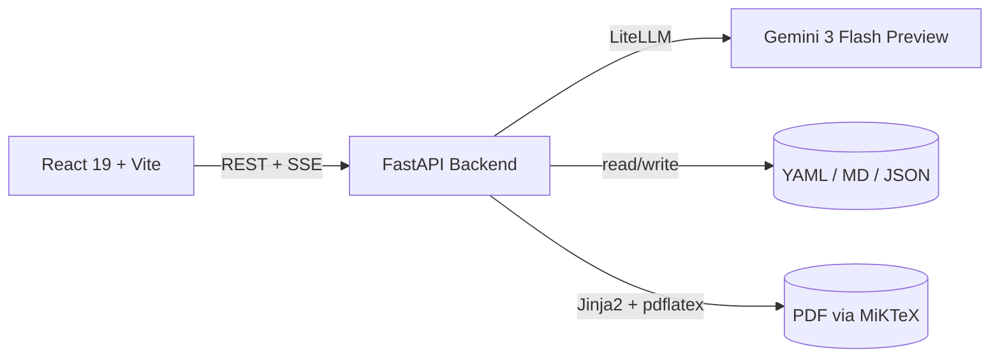

# Codebase Overview

> Full-stack application that generates ATS-optimized resume bullet points and compilable LaTeX resumes from a project portfolio, personal profile, and target job descriptions -- powered by Gemini 3 Flash Preview via a provider-agnostic LLM abstraction layer.

**Last updated:** 2026-07-01
**Primary language:** Python 3.12+ (backend), TypeScript 5.6 (frontend)
**Architecture style:** Full-stack monolith (separate frontend/backend processes)

---

## Architecture overview

The system is a two-process monolith: a Python FastAPI backend (`:8000`) and a React/Vite frontend (`:5173`). There is no database -- all state is file-based (YAML profile, Markdown project summaries, per-application JSON files).

A user pastes a job description into the frontend. The backend's `Orchestrator` runs an 8-stage pipeline: load projects from `docs/PROJECT_SWEEP_SUMMARIES.md`, match relevant projects via LLM, analyze keywords, generate ATS-optimized bullet points (streamed via SSE), compile/deduplicate sections, render to LaTeX via Jinja2, and optionally compile to PDF via MiKTeX. Each stage emits progress events over Server-Sent Events (SSE) to the frontend.

LLM calls go through LiteLLM, making the provider swappable without code changes. The backend is fully async (FastAPI + asyncio). Tests use `pytest-asyncio` in auto mode.



---

## Tech stack

| Layer | Technology | Notes |
|---|---|---|
| Backend runtime | Python 3.12+ | Requires `>=3.11` per pyproject.toml; `uv` as package manager |
| Web framework | FastAPI 0.115+ | Pydantic v2 models; all handlers async; SSE for generation |
| LLM abstraction | LiteLLM 1.40+ | Provider-agnostic; default model `gemini/gemini-3-flash-preview` |
| Templating | Jinja2 3.1+ | Used for both prompt templates (`.j2`) and LaTeX resume rendering |
| Frontend runtime | React 19 + TypeScript 5.6 | Vite 6 bundler; `vitest` + `jsdom` for tests |
| Data fetching | TanStack React Query 5 + Axios | Query hooks in `frontend/src/api/` |
| Routing | react-router-dom 7 | 7 pages; client-side routing |
| Styling | CSS variables + dark theme | Custom design system in `frontend/src/styles/` |
| Config | Pydantic BaseSettings | Typed env vars; `.env` file loaded at startup |
| Testing | pytest 8 + pytest-asyncio 0.24 | `asyncio_mode = "auto"` -- no manual marks needed |
| PDF compilation | MiKTeX (optional) | Enabled via `PDLATEX_PATH` env var; not required for core flow |

---

## Entry points

| Entry | Command | Purpose |
|---|---|---|
| Backend server | `cd backend && uv run uvicorn app.main:app --reload --port 8000` | FastAPI app; configures LiteLLM and warms project cache on startup |
| Frontend dev server | `cd frontend && npm run dev` | Vite dev server on `:5173`; proxies `/api` to `:8000` |
| Backend tests | `cd backend && uv run pytest` | Runs all async tests (auto mode) |
| Frontend tests | `cd frontend && npm run test` | Vitest in jsdom environment |

`backend/app/main.py` creates the FastAPI app via `create_app()`, adds CORS middleware, and mounts the API router under `/api`. The lifespan event configures LiteLLM and loads the project sweep file into memory.

---

## Key modules

### Backend (`backend/app/`)

| Path | Responsibility |
|---|---|
| `backend/app/main.py` | App factory, lifespan (LiteLLM config + sweep cache warm-up), CORS |
| `backend/app/config.py` | `Settings` (Pydantic BaseSettings) -- all env vars in one place |
| `backend/app/pipeline/orchestrator.py` | 8-stage pipeline coordinator; ties all services together |
| `backend/app/pipeline/matching_service.py` | Scores project relevance against job descriptions via LLM |
| `backend/app/pipeline/keyword_analysis_service.py` | Extracts structured keywords from job descriptions |
| `backend/app/pipeline/resume_points_generator.py` | Generates ATS-optimized bullet points per section (streamed) |
| `backend/app/pipeline/resume_writer.py` | Compiles, deduplicates, and polishes sections |
| `backend/app/pipeline/latex_renderer.py` | Converts profile + sections to LaTeX via Jinja2 template |
| `backend/app/pipeline/pdf_compiler.py` | Compiles LaTeX to PDF via MiKTeX (optional) |
| `backend/app/services/llm_service.py` | Provider-agnostic LLM client; per-task model routing; retry logic |
| `backend/app/services/profile_service.py` | Loads YAML profile + Markdown subjective profile |
| `backend/app/services/history_service.py` | Persists/loads Application records as JSON files |
| `backend/app/services/project_sweep_service.py` | Parses `PROJECT_SWEEP_SUMMARIES.md` into structured ProjectEntry objects |
| `backend/app/services/prompt_manager.py` | Loads Jinja2 prompt templates from `templates/prompts/` |
| `backend/app/api/router.py` | Aggregate router mounting 5 domain sub-routers under `/api` |
| `backend/app/utils/sse.py` | `SSEEventBuilder` helper for constructing SSE payloads |

### Frontend (`frontend/src/`)

| Path | Responsibility |
|---|---|
| `frontend/src/App.tsx` | Route definitions for 7 pages under `AppLayout` |
| `frontend/src/pages/NewApplication.tsx` | Job description input and project selection for new generation |
| `frontend/src/pages/ReviewEdit.tsx` | Review and edit generated bullet points |
| `frontend/src/pages/ExportResume.tsx` | LaTeX preview and PDF/tex export |
| `frontend/src/pages/HistoryPage.tsx` | Browse past application generations |
| `frontend/src/pages/ProfilePage.tsx` | View/edit user profile |
| `frontend/src/pages/ConfigPage.tsx` | LLM config and PDF availability settings |
| `frontend/src/pages/Dashboard.tsx` | Landing page with overview |
| `frontend/src/api/client.ts` | Axios instance configured for `/api` base URL |
| `frontend/src/api/resume.ts` | SSE streaming client for generation endpoints |
| `frontend/src/components/generation/` | `BulletEditor` and `ProgressPanel` for streaming UI |

> `backend/app/pipeline/orchestrator.py` -- Central coordinator for the entire generation pipeline. Changes here affect all generation paths (full, points-only, resume-only, section-regenerate). Test all four flows before merging.

---

## API routes

All routes are mounted under `/api`:

| Prefix | Router file | Endpoints |
|---|---|---|
| `/api/profile` | `api/profile.py` | User profile CRUD |
| `/api/projects` | `api/projects.py` | List, search, get by ID, refresh, LLM-powered match |
| `/api/generate` | `api/resume.py` | `POST /points`, `POST /resume`, `POST /regenerate-section`, `GET /{id}/tex`, `GET /{id}/pdf` |
| `/api/applications` | `api/history.py` | Application history CRUD |
| `/api/config` | `api/config.py` | `GET/PUT /llm`, `GET /pdf-available` |
| `/api/health` | `api/router.py` | `GET /health` -- returns status and version |

The `/api/projects/match` endpoint instantiates its own `LLMService(config=get_llm_config())` and `MatchingService` to perform LLM-powered project relevance scoring.

---

## Data layer

There is **no database**. All state is file-based:

| Data | Format | Location | Purpose |
|---|---|---|---|
| User profile | YAML | `backend/data/profile.yaml` | Name, contact, experience, education, skills |
| Narrative profile | Markdown | `backend/data/subjective_profile.md` | Free-form professional narrative |
| Project summaries | Markdown | `docs/PROJECT_SWEEP_SUMMARIES.md` | Projects with type, tech stack, features, resume value |
| Applications | JSON | `backend/data/applications/{id}.json` | Per-application generated content, status, and metadata |

**No migrations, no Alembic, no schema versioning.** Changing the structure of `profile.yaml` or `PROJECT_SWEEP_SUMMARIES.md` requires updating the corresponding Pydantic models in `backend/app/models/`.

---

## Non-Obvious Patterns

**All generation endpoints stream via SSE, not REST responses**
The frontend connects to streaming endpoints. The backend calls `emit(event_type, data_dict)` at each pipeline stage. Token-level streaming uses `SSEEventBuilder.token()`. The frontend consumes these via `EventSource` or Axios streaming. Do not add non-streaming generation endpoints -- the UI depends on progressive rendering.

**Prompt templates are Jinja2 files with runtime overrides**
Prompt templates live in `backend/app/templates/prompts/*.j2`. The `PromptManager` loads them, but the `Settings` class supports runtime overrides via `PROMPT_MATCHING`, `PROMPT_KEYWORD_ANALYSIS`, etc. env vars. If a prompt env var is set, it takes precedence over the `.j2` file. This means prompt changes in development don't always require editing `.j2` files.

**Per-task model routing via `TaskModelConfig`**
`LLMService.get_model_for_task(task)` checks `LLMConfig.tasks` for per-task overrides before falling back to the default model. Tasks include `matching`, `keyword_analysis`, `resume_points`, and `resume_writeup`. This allows routing different pipeline stages to different models (e.g., cheaper model for keyword analysis).

**Structured LLM responses use retry-on-parse-failure**
`LLMService.generate_structured()` catches JSON parse errors and automatically retries once with an instruction to fix the output. This handles common LLM failure modes (markdown fences, truncated JSON). Never catch `LLMParseError` in calling code -- it already includes retry logic.

**LLM retry with exponential backoff for transient errors**
`LLMService.generate()` retries up to 3 times with exponential backoff (1s, 2s, 4s) for `LLMConnectionError` and `LLMRateLimitError`. Auth errors (`LLMAuthError`) are not retried. The `_handle_error()` method classifies raw exceptions: `503`/`ServiceUnavailable` maps to `LLMConnectionError`, `429`/`Too Many Requests` maps to `LLMRateLimitError`, and `authentication`/`api key` maps to `LLMAuthError`.

**Project sweep file is cached at startup, not re-read per request**
`ProjectSweepService.get_all()` loads `docs/PROJECT_SWEEP_SUMMARIES.md` once during the lifespan event. The in-memory cache serves all requests. To pick up project changes, restart the backend server or call `POST /api/projects/refresh`. The `orchestrator` calls `get_all()` but this hits the cache, not disk.

**Section keys follow a naming convention**
Section keys in `SectionPoints` use the format `project:{id}` or `experience:{company-slug}`. The `regenerate_section()` method parses these to find the source data. When adding new section types, update `_build_section_context()` in the orchestrator.

**LLM config is a lazy singleton, not persistent**
`get_llm_config()` in `backend/app/api/config.py` initializes the `LLMConfig` from `settings` on first access. `PUT /api/config/llm` updates it in-memory only -- changes are lost on server restart. The `LLMService` reads this config at instantiation time.

**Tests use temporary directories, not real data**
All backend tests create `tempfile.TemporaryDirectory` instances for data files. The `conftest.py` provides `tmp_data_dir` and `sample_sweep_file` fixtures. Tests never read from `backend/data/` -- run `pytest` safely in any environment.

---

## Development Workflow

```bash
# 1. Backend dependencies (uv required)
cd backend
uv sync

# 2. Backend dev server
uv run uvicorn app.main:app --reload --port 8000

# 3. Frontend dependencies
cd ../frontend
npm install

# 4. Frontend dev server
npm run dev

# 5. Backend tests
cd backend
uv run pytest

# 6. Frontend tests
cd frontend
npm run test
```

**Environment variables:** Copy or create a `.env` file in `backend/`. Required vars are defined in `backend/app/config.py` (Pydantic BaseSettings). Key variables:
- `GEMINI_API_KEY` -- Required for LLM calls
- `LLM_DEFAULT_MODEL` -- Defaults to `gemini/gemini-3-flash-preview`; override to use a different provider
- `PDFLATEX_PATH` -- Optional; path to `pdflatex` binary for PDF compilation
- `CORS_ORIGINS` -- Defaults to `http://localhost:5173`
- `SWEEP_FILE_PATH` -- Optional; path to project summaries file (defaults to `../../PROJECT_SWEEP_SUMMARIES.md` relative to CWD)

---

## Architecture Decisions

**File-based state, not a database**
The application stores profile data as YAML, project summaries as Markdown, and application records as JSON files. Rationale: the tool is locally-run and single-user; a database would add operational complexity without benefit. All file I/O goes through service classes (`ProfileService`, `ProjectSweepService`, `HistoryService`), which abstracts the storage format.

**Provider-agnostic LLM via LiteLLM**
All LLM calls route through `litellm.acompletion()`, not a provider-specific SDK. This allows swapping Gemini for DeepSeek, OpenAI, or Anthropic by changing model strings and API keys -- no code changes. The `LLMConfig` model supports per-task routing for cost/performance optimization.

**Jinja2 for both prompts and LaTeX**
Prompt templates and the LaTeX resume template both use Jinja2. This reuses a single templating language across two different concerns. Prompt templates render to text strings; the LaTeX template renders to `.tex` files. The `PromptManager` and `LaTeXRenderer` handle these separately.

**No CI/CD pipeline**
The project has no CI workflows, Docker setup, or deployment automation. It runs locally. If CI is added later, the existing test suites (`pytest` backend, `vitest` frontend) are ready to integrate.

---

## Things to Know Before Changing Code

- `docs/PROJECT_SWEEP_SUMMARIES.md` is the source of truth for all project data. Adding a project requires updating both this file and its corresponding `ProjectEntry` fields in the sweep parser. The `SWEEP_FILE_PATH` env var can override the default location.
- The `Settings` singleton in `backend/app/config.py` is instantiated at import time (`settings = Settings()`). Env vars must be set before the module is imported. In tests, use fixtures that patch `settings` rather than setting env vars directly.
- The Vite dev server proxies `/api` to `localhost:8000`. If you change the backend port, update `vite.config.ts` accordingly.
- LaTeX compilation is optional. The `PDFLATEX_PATH` env var defaults to `None`. If not set, the system generates `.tex` content but does not compile to PDF. Do not assume PDF output exists.
- Prompt templates in `backend/app/templates/prompts/` can be overridden at runtime via env vars. If a prompt seems to produce unexpected output, check for env var overrides before editing the `.j2` file.
- `LLMService._handle_error()` classifies exceptions by string matching on the error message. Adding new error types requires updating this method. The `503`/`ServiceUnavailable` classification as `LLMConnectionError` is intentional -- these are transient and retried.
- The `/api/projects/match` endpoint creates its own `LLMService` and `MatchingService` instances (not the shared orchestrator services). If you change service initialization, update both `get_orchestrator()` in `api/resume.py` and the match endpoint in `api/projects.py`.

---

## Documents

The `docs/` directory contains:

| File | Purpose |
|---|---|
| `docs/postman-testing-guide.md` | curl/Postman examples for all API endpoints |
| `docs/sample-payloads.md` | Request/response JSON examples |
| `docs/PROJECT_SWEEP_SUMMARIES.md` | Source of truth for project data |
| `docs/liteLLM_gemini.md` | Notes on LiteLLM + Gemini integration |
| `docs/resume_points_sample.j2` | Sample prompt template |
| `docs/template.tex` | Sample LaTeX resume template |

---

## Testing

184 pytest tests across 9 test files. Run with `cd backend && uv run pytest`.

| Test file | Coverage area |
|---|---|
| `tests/test_api.py` | API endpoint integration tests |
| `tests/test_llm_service.py` | LLM client, retry logic, error classification |
| `tests/test_prompt_manager.py` | Template loading, env-var overrides, caching |
| `tests/test_profile_service.py` | YAML profile loading |
| `tests/test_project_sweep_service.py` | Sweep file parsing, indexing, search |
| `tests/test_keyword_analysis_service.py` | Keyword extraction |
| `tests/test_latex_renderer.py` | LaTeX template rendering |
| `tests/test_history_service.py` | Application persistence |
| `tests/test_phase7_regressions.py` | Phase 7 bug fixes (PromptManager args, LLM config, SSE serialization) |
